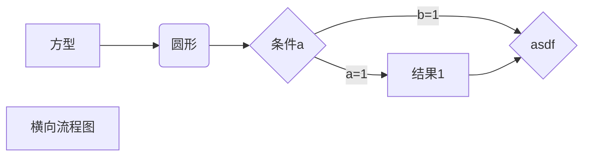

## 一修饰

### 1.加粗

__这是一条神奇的粗线__

### 2.斜体

### 3.下划线

### 4.删除线

~~删除这个记录~~

### 5.分割线

------

------

------

## 二版式

### 1大纲级别

一共有6级分别用######

### 2区块

> 这是个区块
>
> > 里面还有一个区块
> >
> > > 还有一个区块

### 3目录

[TOC]

## 三代码块

~~~lua
```
```
```
```
```
```
~~~

## 四列表

### 1.无序列表

- libiao1
- 列表2

#### 1.1多级无序

- 列表3
  - 鞋标
  - - 列表
- adsfasf

#### 1.2任务列表

- [x] adfasdfad
- [x] 这里有个任务

### 2.有序列表

1. 列表1
2. 列表2
3. 列表4
4. 列表5

### 3.表格

|   车型    | 续航 | 轴距 | 价钱  | 情况         |
| :-------: | :--: | :--: | :---: | ------------ |
|  帝豪GSE  | 353  | 2700 | 13.58 | 续航低       |
| 北汽ex360 | 200  | 2519 |   9   | 续航低 车小  |
| 比亚迪元  | 300  | 2535 | 9.39  | 续航低 无车  |
|  瑞虎3xe  | 401  | 2555 |   9   | 碰头内饰差   |
|  荣威ei5  | 420  | 2670 | 13.88 | 后排不能抬头 |

### 五 链接

### 1.插入图片


### 2.插入超链接

[百度](site.baidu.com)


## 流程图




### 标准流程图

```flow
st=>start: 开始狂
op=>operation: 处理狂
cond=>condition: 判断框(是或否)
e=>end: 结束框

st->op->cond

```


