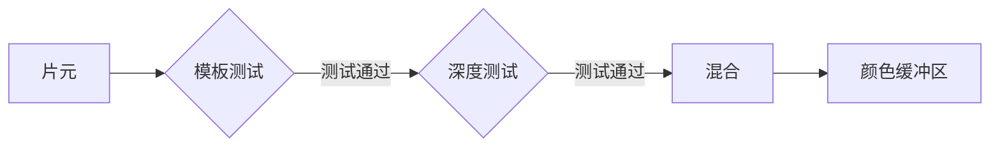

------

[TOC]


### 阶段

- #### 应用阶段

  1. 由cpu实现，准备好场景数据，摄像机位置，视椎体，场景模型，光源
  2. 粒度剔除将不可见物体剔除
  3. 设置渲染状态 材质 纹理 使用的shader
  4. 输出渲染图元(点线三角面等)
- #### 几何阶段

  1. GPU完成
  2. 顶点着色器
  3. 和每个渲染图元打交道，逐顶点，逐多边形操作，把顶点坐标变换到屏幕空间中，再交给光栅器处理
  4. 输出屏幕空间的二维顶点坐标，每个顶点的深度值，着色信息等
- #### 光栅化阶段

  1. 产生屏幕像素，渲染最终结果GPU上运行 决定哪些像素应该被绘制在屏幕上
  2. 需要对上一阶段得到的逐顶点数据纹理坐标颜色等进行插值然后再进行逐像素处理
  3. 三角形设置 三角形遍历 片元着色器

##### 顶点着色器

##### 片元着色器 

输入：上一个阶段对顶点信息插值得到的结果
输出：一个或多个颜色值
根据顶点信息通过某些技术比如纹理采样等生成片元信息颜色值等

#####三角形设置

计算光栅化网格所需要的信息，通过顶点得到整个三角形对像素的覆盖情况，计算一个三角网格表示数据的过程是三角形设置

##### 三角形遍历

判断三角网格覆盖了哪些像素，对应像素生成一个片元，片元状态（屏幕坐标，深度信息，顶点信息如法线纹理坐标等）是对3个顶点信息进行插值得到的。

##### 逐片元操作

通过了所有测试后，新生成的片元才能和颜色缓冲区中已经存在的像素颜色进行混合，最后再写入到颜色缓冲区




流程图

```flow
st=>start: 顶点数据

op1=>operation: 顶点着色器
op2=>operation: 曲面着色器
op3=>operation: 几何着色器
op4=>operation: 剪裁
op5=>operation: 屏幕映射

op6=>operation: 三角形设置
op7=>operation: 三角形遍历
op8=>operation: 片元着色器
op9=>operation: 逐片元操作
e=>end: 屏幕图像

st(right)->op1(right)->op2(right)->op3(right)->op4(right)->op5
op5->op6->op7->op8->op9
op9(right)->e

```

